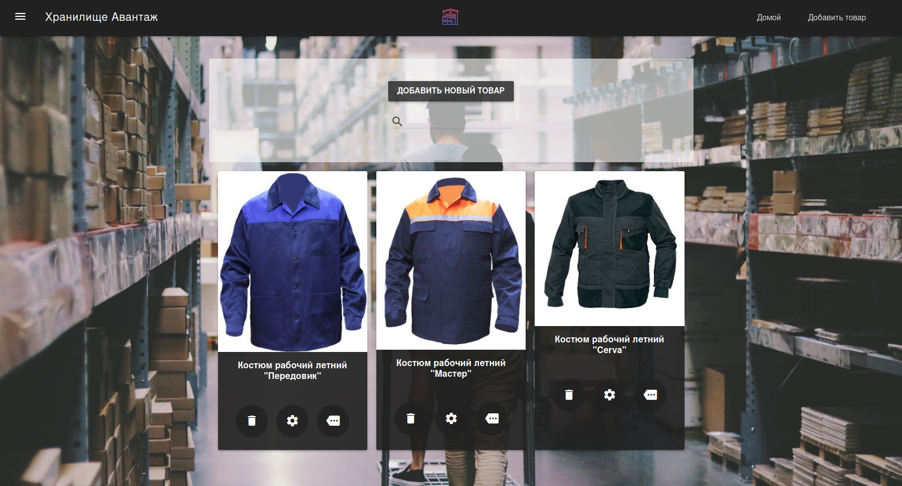

# Storage Avantage

Product storage system for the company [Avantage](http://so-nn.ru).



## Installation

```console
foo@bar: storage-avantage $ docker-compose build
foo@bar: storage-avantage $ docker-compose run web python manage.py makemigrations
foo@bar: storage-avantage $ docker-compose run web python manage.py migrate
```

## Run

```console
foo@bar: storage-avantage $ docker-compose up
```

## Authors

 - **Maxim Mukhin** - [Stonedch](https://github.com/stonedch)

## License

[GNU GPL v3](LICENSE.md)
